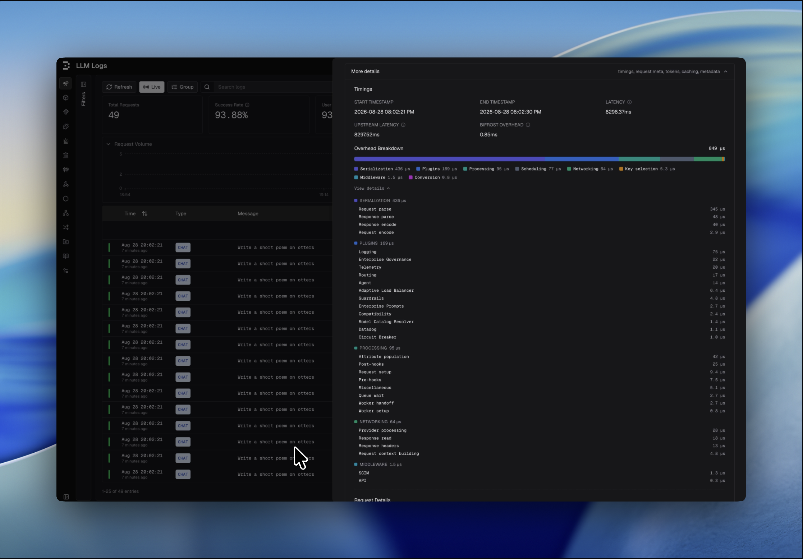

## Overview

Every request Bifrost handles splits into two parts:

```
latency = upstream + overhead
```

- **Upstream** is time spent waiting on the provider: the network round trip and the provider's own compute. Bifrost cannot make this faster.
- **Overhead** is Bifrost's own work: parsing the request, converting schemas, running plugins, selecting a key, handing the request between goroutines, and writing the response back.

The **Overhead breakdown** in the log detail view decomposes that overhead into named buckets, grouped into nine categories, so you can see exactly which part of the pipeline a request spent time in.

<Info>
The breakdown is populated automatically whenever logging is enabled. There is nothing to configure. See [Built-in Observability](/features/observability/default) for enabling logging.
</Info>



---

## How it's measured

Each phase of the pipeline is wrapped in a span. A bucket's value is the span's **self-time**: its own wall-clock duration minus the duration of its direct children. Because a child's time is subtracted from its parent, work is counted exactly once no matter how deeply spans nest, and the buckets never double-count.

```mermaid
graph LR
    A[Client request] --> B[Serialization<br/>parse]
    B --> C[Middleware<br/>auth]
    C --> D[Processing<br/>setup + pre-hooks]
    D --> E[Plugins]
    E --> F[Key selection]
    F --> G[Conversion +<br/>Serialization<br/>encode]
    G --> H[Networking<br/>sign + call]
    H --> I[[Upstream<br/>provider]]
    I --> J[Serialization<br/>parse + Conversion]
    J --> K[Processing<br/>post-hooks]
    K --> L[Serialization<br/>encode + Client delivery]
    L --> M[Client response]
```



Two categories are **residuals** rather than measured spans: they capture whatever time is left over after every instrumented phase, so no overhead ever goes missing (see [The two residuals](#the-two-residuals)).

---

## The categories

The breakdown groups its rows into nine categories. Each table below lists every row in a category by the name shown in the drill-down and what it measures.

### Serialization

JSON parsing and encoding at the edges of the request.

| Name | What it measures |
|------|------------------|
| Request parse | Decoding the incoming client request body into Bifrost's request struct |
| Request encode | Encoding the provider-shaped request into JSON bytes for the upstream call |
| Response parse | Decoding the provider's raw JSON response into a provider response struct |
| Response encode | Encoding the final Bifrost response back to JSON for the client |

### Conversion

Translating between Bifrost's unified schema and a provider's native shape.

| Name | What it measures |
|------|------------------|
| Schema conversion | Mapping the unified request/response to and from the provider's native format |
| Stream convert (inbound) | Per-chunk mapping of provider chunks into the unified shape (streaming only) |
| Stream convert (outbound) | Per-chunk mapping of unified chunks into the client's shape (streaming only) |

### Plugins

Time spent inside each configured plugin's hooks. One row per plugin, shown by the plugin's name (for example, **Enterprise Governance**, **Semantic Cache**, **OpenTelemetry**), collapsing that plugin's individual hook phases (pre-hook, post-hook) into a single row. Any plugin you configure appears here automatically.

### Middleware

HTTP transport authentication and access control, run before the request enters the core pipeline.

| Name | What it measures |
|------|------------------|
| API | API-key validation |
| SCIM | SCIM identity resolution |
| Auth | Session / access-control checks |

### Key selection

Choosing which provider API key to use for the request.

| Name | What it measures |
|------|------------------|
| Key selection | The weighted pick of a specific key from the pool |
| Key pool | Locating the key pool for the resolved provider |

<Note>
**Key pool** and **Key selection** are merged into a single **Key selection** row in the drill-down, since both are steps of choosing the key.
</Note>

### Processing

The internal request pipeline: the glue that moves a request through the core, across worker goroutines, and back.

| Name | What it measures |
|------|------------------|
| Request setup | Publishing the model catalog to context and staging the pre-request hook |
| Pre-hooks | The LLM pre-hook pipeline loop around the per-plugin spans |
| Post-hooks | The LLM post-hook pipeline loop around the per-plugin spans |
| Worker setup | Per-attempt field re-read and setup after a worker dequeues the request |
| Worker handoff | The goroutine-hop latency from the worker back to the caller |
| Queue wait | Time the request waits in the provider queue before a worker picks it up |
| Attribute population | Writing prompt and message attributes onto the LLM call span |
| Miscellaneous | Pre-dispatch glue that sits on no other span: field re-reads, validation, MCP tool merge, channel-message setup |

### Networking

Handling the request between the client, the gateway, and the provider.

| Name | What it measures |
|------|------------------|
| Request context building | Building the request-scoped context at the HTTP edge |
| Response headers | Writing routed-identity and upstream headers onto the HTTP response |
| Request signing | Signing the upstream request (for example, AWS SigV4 for Bedrock) |
| Credential fetch | Fetching provider credentials (for example, a Vertex or Bedrock token) |
| Response read | Reading and finalizing the provider's HTTP response, including header extraction |
| Provider processing | Provider-side handling not covered by the measured phases (a residual, see below) |

### Client delivery

Streaming egress: sending chunks back to the client over the response socket.

| Name | What it measures |
|------|------------------|
| Client write | Writing chunks to the client socket (SSE egress) |
| Client backpressure | Time the relay stalls waiting for a slow client to accept the next chunk |

### Scheduling

| Name | What it measures |
|------|------------------|
| Scheduling | Goroutine-scheduling latency between phases, plus any edge not covered by a measured phase (a residual, see below) |

---

## The two residuals

Two rows are not measured directly from a phase. They are computed as what remains after everything instrumented is accounted for, so overhead always reconciles.

### Provider processing

The **Provider processing** row is a residual. Every provider call runs inside a span that envelops both the upstream network call and all provider-side handling. The upstream network round trip is subtracted out (it counts as upstream, not overhead), and the measured phases (request conversion, marshalling, signing, response read, parsing) are subtracted out too. What remains is the provider handler's own work that is not yet broken out into a finer phase.

Coverage of those finer phases varies by provider, so this row tends to be larger for providers that expose fewer phases. A **large Provider processing** value simply means more of that provider's handling is not yet itemized. It is normal for it to be small.

### Scheduling

The **Scheduling** row is the overhead total minus the sum of every measured row. This is the goroutine-scheduling latency as the request hops across the HTTP, core-pipeline, and provider-worker goroutines, plus any transport edge not yet measured. With request/response conversion, marshalling, and parsing each now measured on their own, this residual is small.

<Note>
Both residuals are computed for **unary** (non-streaming) requests only. See below for why streaming excludes them.
</Note>

---

## Streaming differences

A streamed response is measured differently, because its provider-call span is deferred: it covers the entire stream (ending on the final chunk), not just setup, while upstream latency is only the time to the first byte. Two consequences:

- **Provider processing and Scheduling are excluded.** For a stream, the provider-call time minus upstream would capture the whole per-chunk relay, which is off-CPU wait time parked between chunks, not Bifrost work. Including it would double-count and mislabel that time.
- **Per-chunk work is captured through dedicated rows instead.** The relay loop stamps its JSON decode, its struct mapping, and its downstream stall as root-span attributes at stream end, which fold into **Response parse** (Serialization), **Stream convert (inbound / outbound)** (Conversion), and **Client write** / **Client backpressure** (Client delivery). A stream's numbers therefore read like a unary request's.

---

## Reading the breakdown

- **Compare overhead against upstream first.** If a request feels slow but overhead is a thin sliver next to upstream, the time is the provider's, not Bifrost's.
- **Look at the largest category.** It tells you where Bifrost spent most of its own time on the request, whether that is serialization, plugins, key selection, or networking.
- **Drill into a category** with **View details** to see its member rows.
- **Other** is a fallback for a row that has no assigned category, which is different from **Scheduling**: Scheduling is measured overhead that belonged to no single phase, whereas Other is a row that exists but has not been filed under a category. Every row Bifrost emits today maps to one of the nine categories, so Other is normally empty.

---

## Next steps

- **[Built-in Observability](/features/observability/default)** - Enable logging and explore request traces.
- **[Request flow](/architecture/core/request-flow)** - How a request moves through the core pipeline that these buckets measure.
